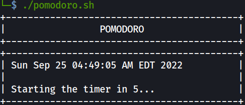

<div align="center">
 <a href="#">
    
</a>
  
<h2 align="center">POMODORO</h2>
  
<p align="center">
    <a
      href="https://github.com/Shirshakhtml/Osint-tool/issues/new?assignees=&labels=bug">Report
      Bug</a>
    ·
    <a href="https://github.com/Shirshakhtml/Osint-tool/issues">Request Feature</a>
  </p>


  
<h3 align="center">A simple bash script to increase your Productivity</h3>

  ## Usage 
```bash
bash pomodoro.sh
``` 
